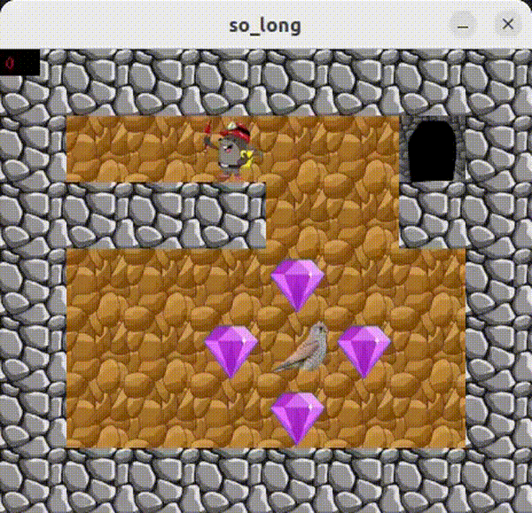
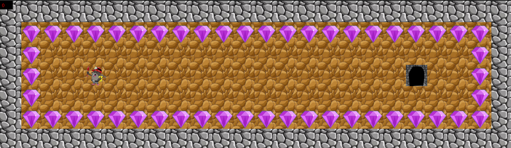

# 2D Game in C

## Description

This project is a simple game where the player must collect all items on the map and reach the exit. The player can only move horizontally and vertically. The map consists of walls, empty spaces, collectible items, and the exit. The player loses if they collide with an enemy. The goal is to create a proof of concept of a 2D game using the MinilibX graphics library and the ANSI C programming language.

### MLX
MinilibX is a simple X-Window programming API in C designed for students and suitable for beginners.

### Code Style
The code style used in this project follows the Norminette, created by 42 School and used in all related ANSI C projects within the school context.

### Installation
Before compiling the project, the MLX library must be installed. Instructions can be found in the MinilibX repository.
To clone this project along with this library, use the following command:

```shell
git clone https://github.com/ELREKO/2D-Game.git
```
Navigate into the cloned directory.
Install the game:
```shell
make re
```

#### Uninstallation
Inside the directory.
```shell
make fclean
make clean
```

### Usage
After compiling the project, an executable file named `so_long` will be created. To start the game, run the executable with the map as an argument:

Example:
```shell
./so_long maps/42big.ber
```
Some maps and the map used to create the header image are located in the `maps` folder.

### Maps

The game can play any map that follows specific rules:

- The map must be a `.ber` file.
- It can only contain some of the following characters:
  - **Character** - **Object**
    - `1` - Wall
    - `0` - Empty space
    - `C` - Collectible
    - `E` - Exit
    - `P` - Player starting position
    - `G` - Enemy
- The map must be a rectangle surrounded by walls `1`.
- It must have at least one exit `E` and one collectible `C`, and only one player `P`.
- See some examples in the `map_files` folder of this project. For example map2.ber


### Changing the Graphics
In the `img` folder, you can replace the existing `.xpm` graphic files with your own graphics. Images should be 50x50 px.
Here's an example with alternative graphic objects.



### Controls
Use `WASD` to move. You move one tile at a time. Enemies move after you, also one tile at a time, and will kill you if you move into their tile or they move into yours. After collecting all collectibles, exits open, and you can exit to see how many moves you've used to solve the map. You can close the game with `Esc`.

### Contributors
If you'd like to contribute and improve this project, you can fork this repository and submit a pull request with your changes. I'll be happy to review and accept your changes.
